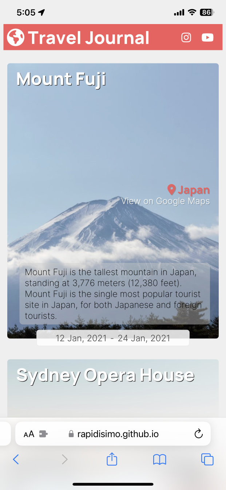

# Scrimba Solo Project (React) - Travel Journal

### [Live Version](https://rapidisimo.github.io/travel-journal/)
[GitHub Repository](https://github.com/Rapidisimo/digital-business-card)

## My Objectives
Feel comfortable with using React props, designing a project with re-usability in mind and modify the design a bit.

## Requirements
1. ✅ Data array in separate .js file   
  1.1 ✅ Title, location, Google Maps link, start date, end date, description, image URL
2. ✅ Use .map() and props to create each entry in the travel journal
3. ✅ ⭐️Styled & Polished⭐️

## Additional Work Beyond Requirements
1. Slightly modify the design.
2. Change the design based on viewport size.

### Question/Challenges
- I felt the CSS to be the most challenging for this project.
- Feedback welcomed on React/props and Design/CSS/Layout.

## Preview

